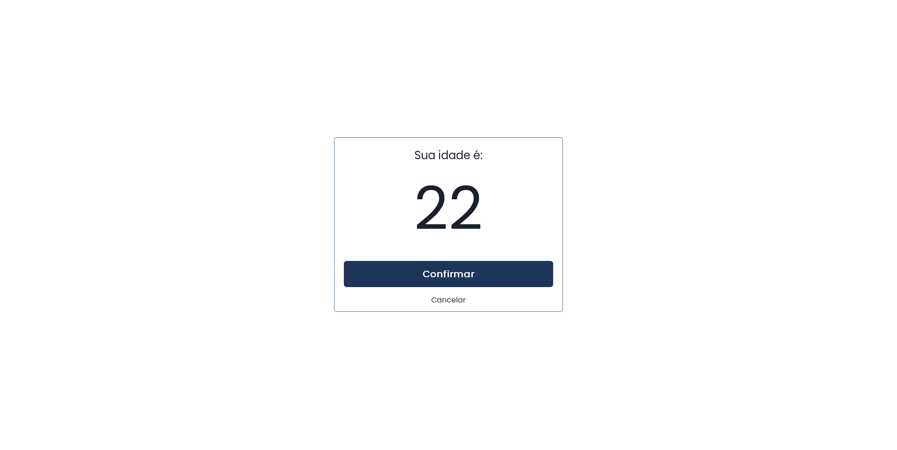
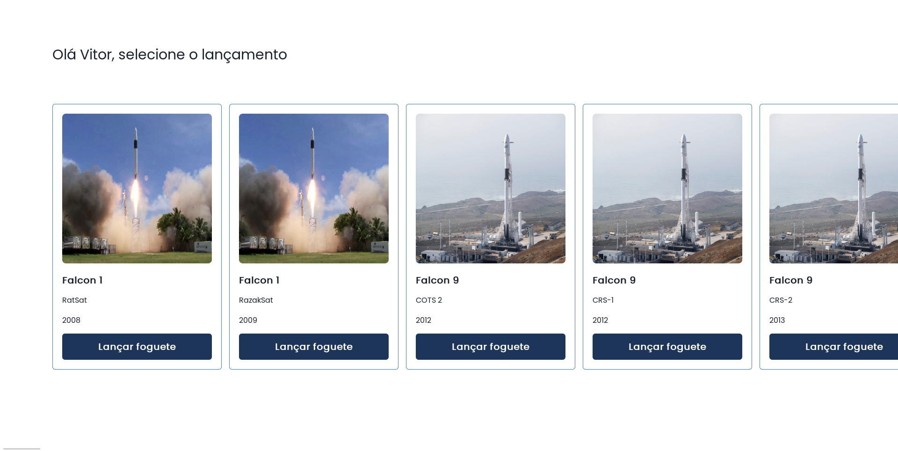
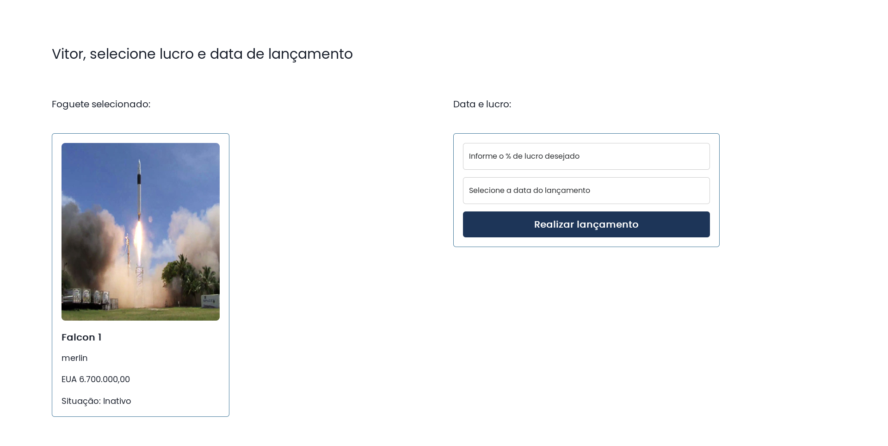
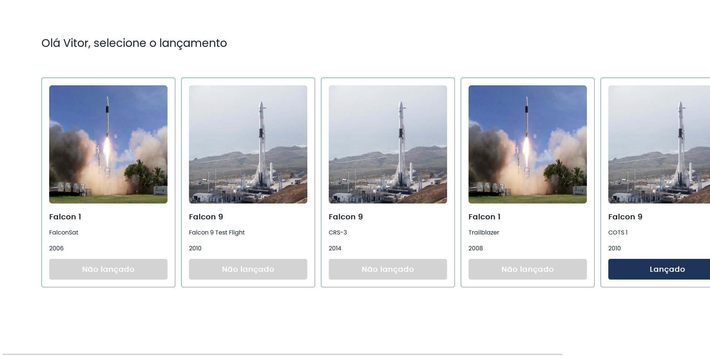

# Documentação do Sistema Rockets Low Costs - Frontend

## Dependências

Node v22.5.1^

Backend [Instalação](../back-end/README.md)

## Instalação

```bash
# clona do repositório
git clone https://github.com/VitorNuness/rockets-low-costs.git rockets

# acessa o diretório criado
cd rockets/front-end/

# instala as dependencias
npm i

# inicia servidor http://localhost:3000
npm run dev
```

---

## Telas

### Login


---

### Registro


---

### Confirmação de idade



---

### Missões



---

### Criar ou atualizar lançamento



---

### Lançamentos


